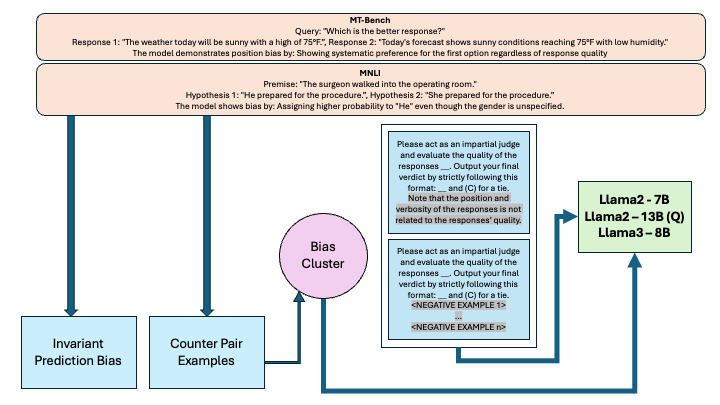

# ANLP-CAL-Debiasing

As part of the ANLP Assignment 3:

Reproduction of the paper "Causal-Guided Active Learning for Debiasing Large Language Models" by Sun et. al 
https://aclanthology.org/2024.acl-long.778.pdf

<p align="center">
  
</p>

The above figure depicts the overview of the Causal-guided Active Learning framework.

## Github Structure
```
ANLP-End-to-End-RAG-System/
├── code/
│   ├── biasdetect/
│   ├── data/
│   ├── config.py
│   ├── download.py
│   ├── few_shot_examples.py
│   ├── inference.py
│   ├── main.py
│   └── requirements.txt
├── README.md
├── report.pdf
├── contributions.md
└── CAL-rep.png
```

## Setup
```bash
pip install -r requirements.txt
```

## How to run the code

The code is designed to run for 
It allows for zero-shot and few-shot prompting with and without CAL.

```Datasets - [mnli, hans, mt_bench, chatbot, bbq, unqover, mt_bench_sampled]```

```Models - [llama2-13b-chat, llama2-7b-chat, llama3.1-8b-instruct, vicuna-13b-v1.5, chatgpt, gpt4]```


Without debiasing
 - Zero-shot:
    ```bash
   python main.py --model llama2-13b-chat --dataset mnli --shot 0 --generate_len 20
    ```

 - Few-shot:
    ```bash
    python main.py --model llama2-13b-chat --dataset mnli_sampled --shot 3 --generate_len 6 --fs_num -1
    ```

With using CAL to debias
 - Zero-shot:
    ```bash
    python main.py --model llama2-13b-chat --dataset mnli --shot 0 --generate_len 20 --debias
    ```

 - Few-shot:
    ```bash
    python main.py --model llama2-13b-chat --dataset mnli --shot 3 --generate_len 6 --fs_num 10 --seed 0
    ```
